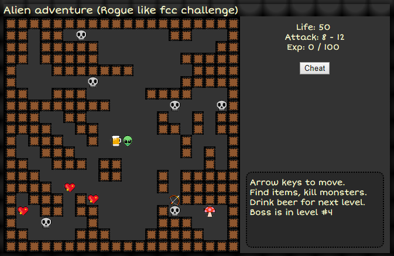
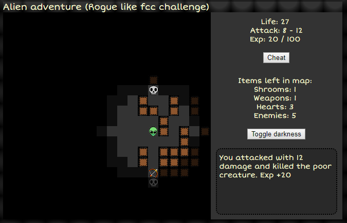

### Fcc Rogue like challenge repo

todo:

* refactoring

Play the game [here.]("https://fraasi.github.io/Rogue-like-fcc/")

 

**Note to future self & others who struggle to host create react app in github.**

[These docs](https://github.com/facebookincubator/create-react-app/blob/master/packages/react-scripts/template/README.md#github-pages) didn't work for me as `npm install --save gh-pages` threw some errors in my window machine and running `npm run deploy` just crashed my cmd window.

Easy enough fix:

* Add homepage to your package.json
* npm run build
* change build folder name to docs
* push to github
* change github page settings to run from 'master branch/docs folder'